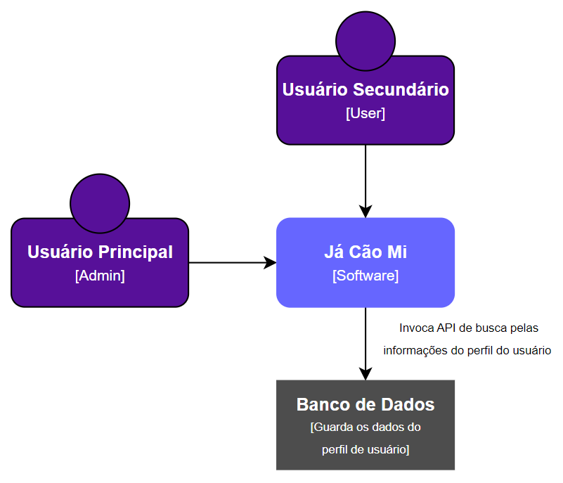

# Diagrama de Contexto
<!--
> Elabore o diagrama de contexto utilizando a notação C4 para o seu produto de software. Esse diagrama apresenta uma visão geral da interação da aplicação arquitetada com o usuário e/ou outros sistemas necessários. É necessário que o diagrama de contexto mostre a comunicação do sistema com um sistema externo (ex.: receita federal)

-->

[Retorna](../README.md)
